## 🌐 Live Demo

**Website:** http://bhumika-website-project-123.s3-website.eu-north-1.amazonaws.com
# ☁️ CloudNova Solutions – Static Website Hosting with CI/CD on AWS

## 📌 Project Overview

CloudNova Solutions is a responsive educational website developed using **HTML, CSS, and JavaScript** and deployed on **Amazon Web Services (AWS)**. The project demonstrates **Static Website Hosting**, **CI/CD Automation**, and a **Serverless Contact Form** using AWS services.

The website includes User and Admin modules, cloud learning resources, workflows, team information, and a contact form integrated with AWS.

---

## 🚀 Features

- 👤 User Login
- 🛡️ Admin Login
- 📊 User Dashboard
- ⚙️ Admin Dashboard
- 🏠 Responsive Home Page
- ℹ️ About Section
- 🛠️ Services Section
- 🔄 Workflow Section
- 👥 Team Section
- 📞 Contact Form
- ☁️ Static Website Hosting on Amazon S3
- 🔄 Automated CI/CD using GitHub & AWS CodePipeline
- ⚡ Serverless Backend using API Gateway & AWS Lambda
- 🗄️ Contact Data Stored in Amazon DynamoDB

---

# 🛠 Technologies Used

| Technology | Purpose |
|------------|---------|
| HTML5 | Website Structure |
| CSS3 | Website Styling |
| JavaScript | Website Functionality |
| Git & GitHub | Version Control |
| Amazon S3 | Static Website Hosting |
| AWS CodePipeline | Continuous Integration & Deployment |
| API Gateway | REST API |
| AWS Lambda (Python) | Backend Processing |
| Amazon DynamoDB | Database |
| IAM | Access Management |

---

# 🏗 AWS Architecture

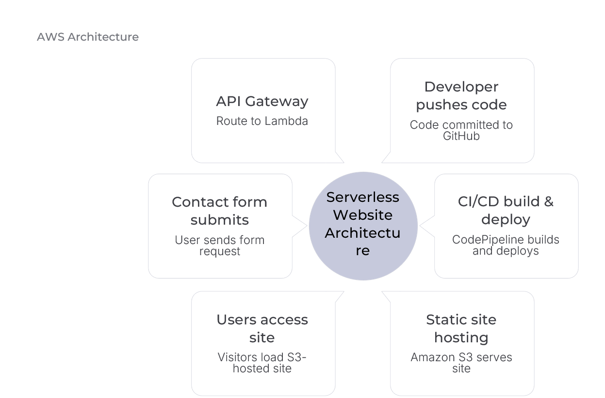

---

# 🔄 CI/CD Workflow

Developer → GitHub → AWS CodePipeline → Amazon S3 → Live Website

Whenever new code is pushed to GitHub, AWS CodePipeline automatically deploys the latest version of the website to Amazon S3.

---

# 📸 Website Screenshots

## 🏠 Home Page
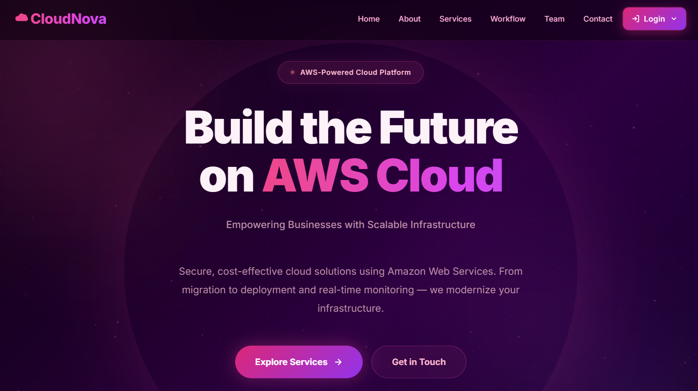

---

## 👤 User Login
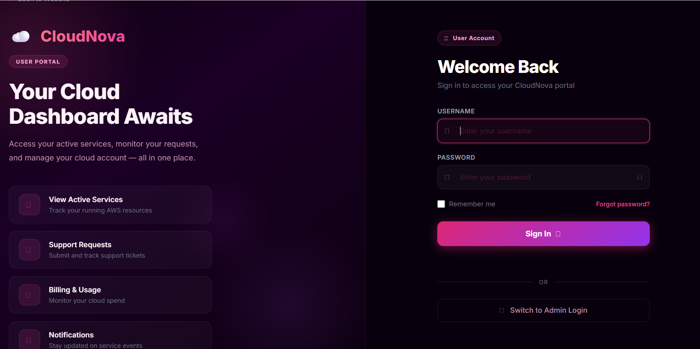

---

## 👨‍💻 User Dashboard
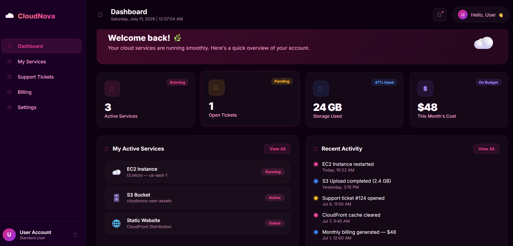

---

## 🔐 Admin Login
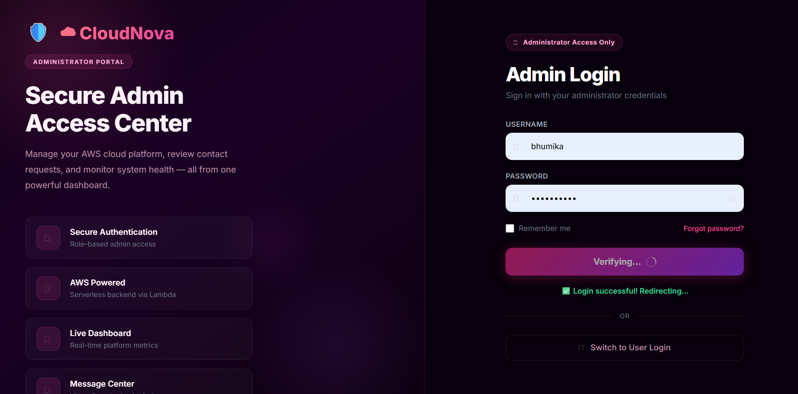

---

## 🛡️ Admin Dashboard
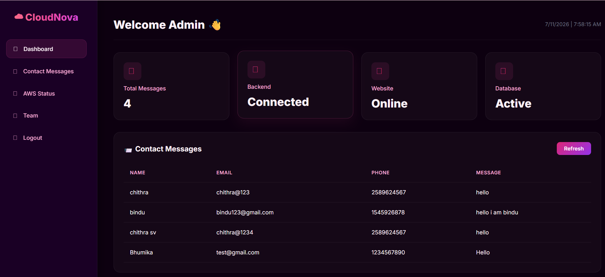

---

## ℹ️ About Page
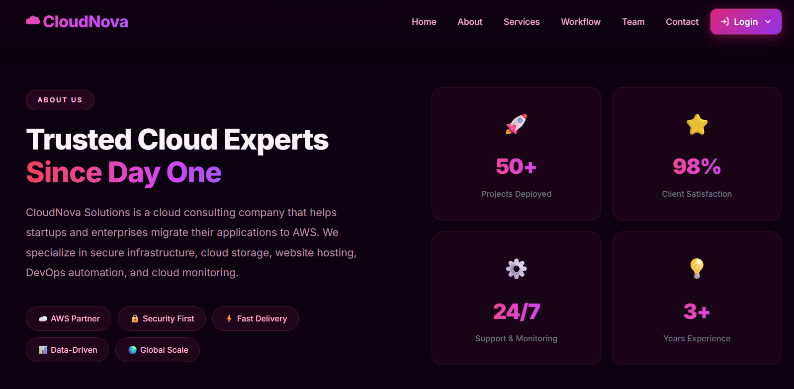

---

## 🛠 Services
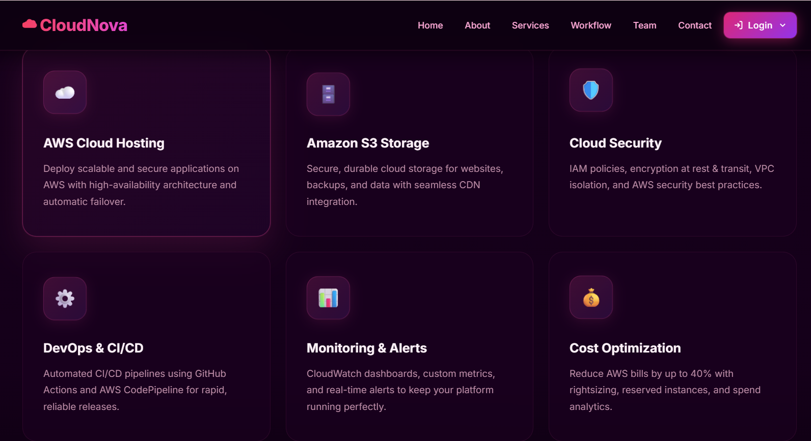

---

## 🔄 Workflow
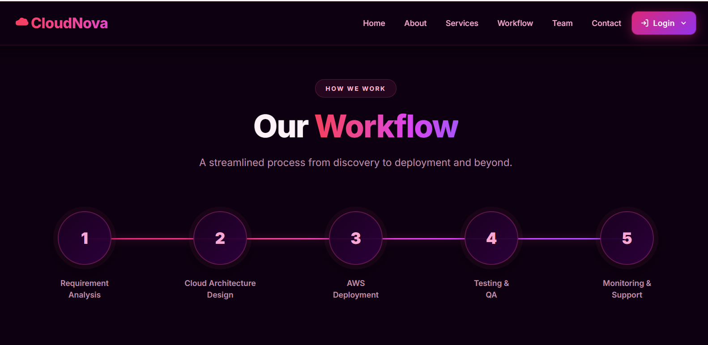

---

---

## 📞 Contact Page
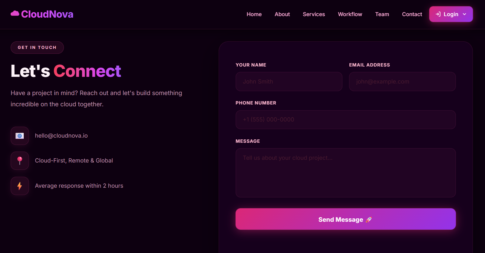

---

# ☁️ AWS Services

## Amazon S3 - Bucket Objects

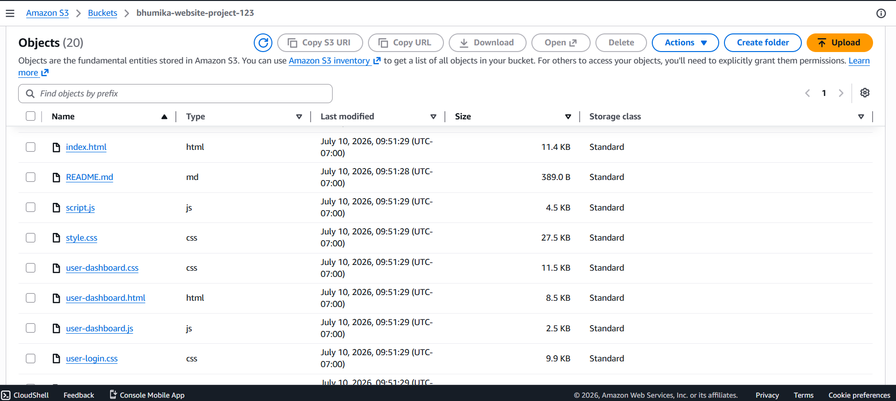

---

## Amazon S3 - Static Website Hosting

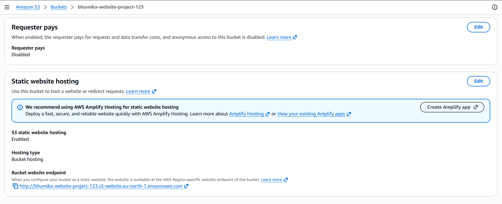

---

## AWS CodePipeline

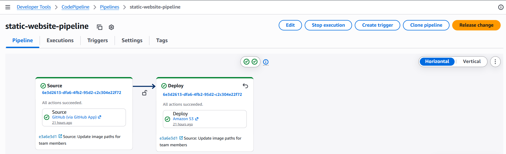

---

## AWS Lambda

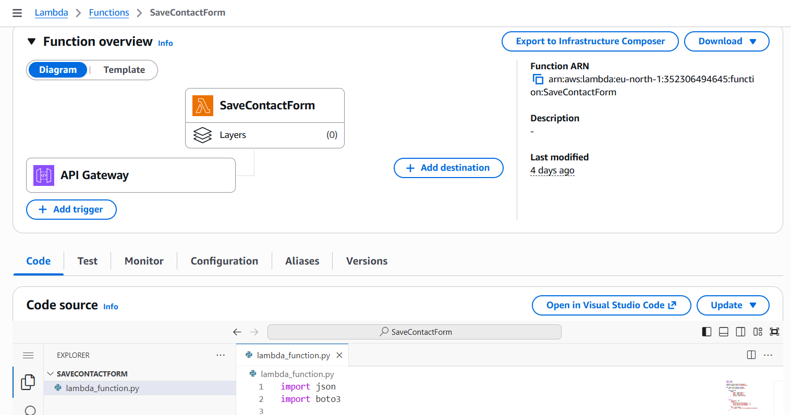

---

## API Gateway

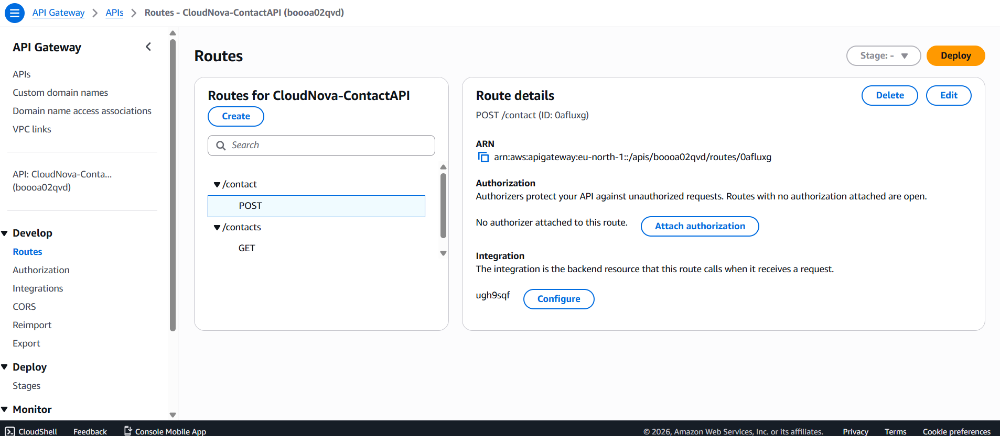

---

## Amazon DynamoDB

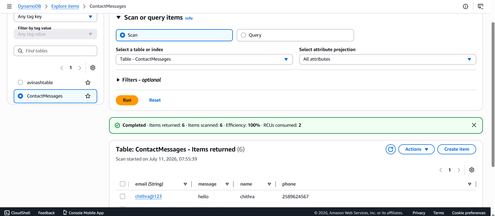

---

# 📋 Project Workflow

1. Developer writes the code.
2. Code is pushed to GitHub.
3. GitHub triggers AWS CodePipeline.
4. CodePipeline automatically deploys the website to Amazon S3.
5. Users access the live website.
6. Contact form sends requests to API Gateway.
7. API Gateway invokes AWS Lambda.
8. Lambda processes the request.
9. Contact information is stored in DynamoDB.
10. A success response is sent back to the user.

---

# 🎯 Learning Outcomes

Through this project, we learned:

- Static Website Hosting using Amazon S3
- GitHub Integration
- AWS CodePipeline
- CI/CD Automation
- Serverless Computing with AWS Lambda
- REST APIs using API Gateway
- Amazon DynamoDB
- IAM Roles and Policies
- Cloud Deployment Best Practices

---

# 🚀 Future Enhancements

- CloudFront Integration
- Custom Domain
- HTTPS using AWS Certificate Manager
- User Authentication with Amazon Cognito
- Monitoring using Amazon CloudWatch
- Multi-factor Authentication (MFA)

---

# 👨‍💻 Team Members

- **Bhumika Basavaraj Tugashetti** – Team Leader
- Team Member 2
- Team Member 3
- Team Member 4

---

# ⭐ Support

If you found this project useful, please consider giving it a ⭐ on GitHub.

---

## 📬 Contact

For any queries or suggestions, feel free to connect with me on LinkedIn or GitHub.
